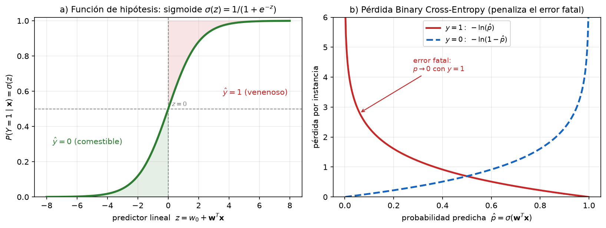
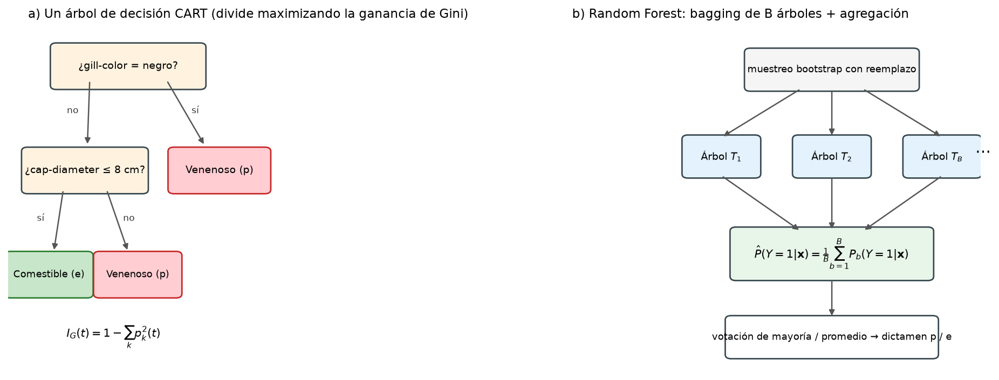
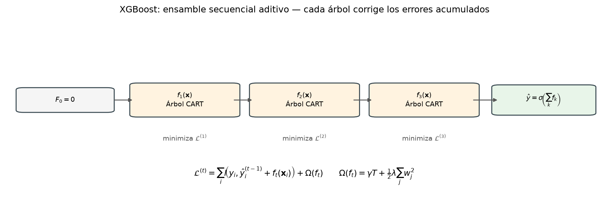
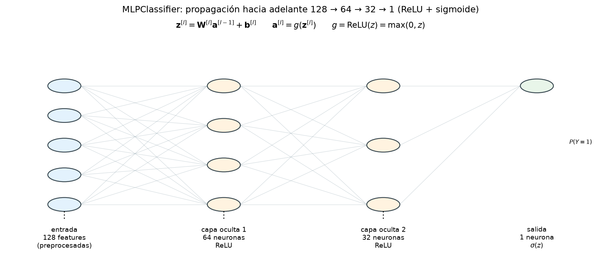
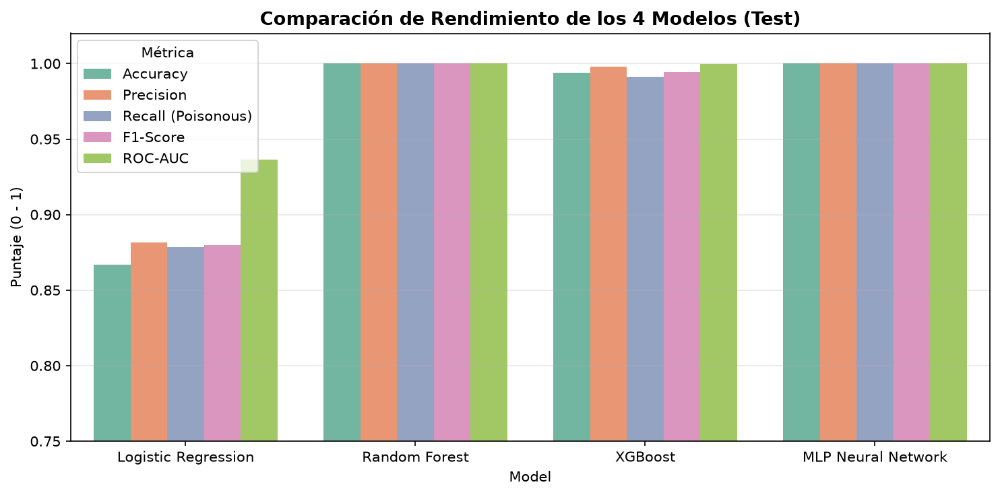
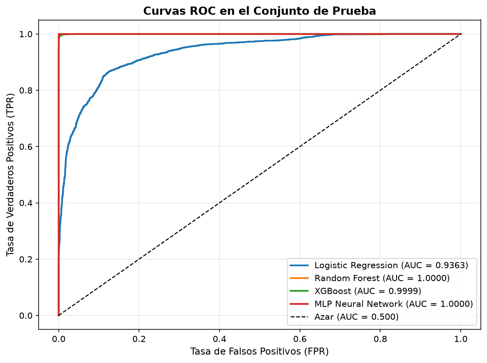
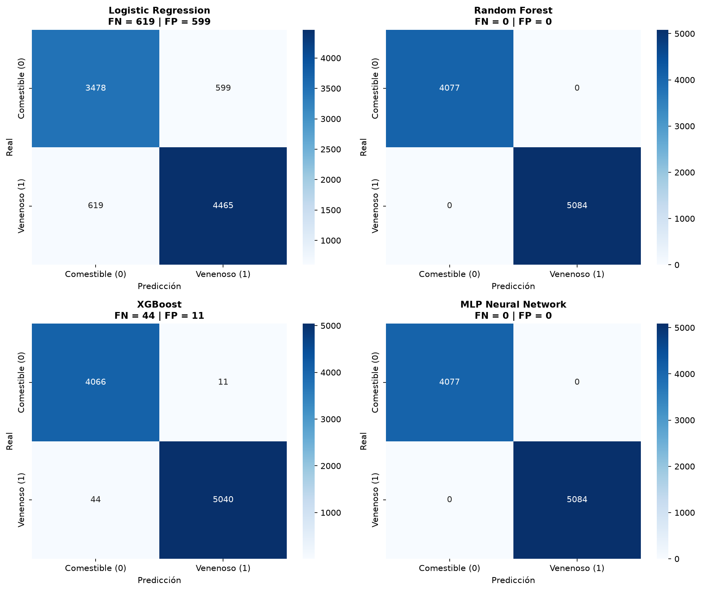
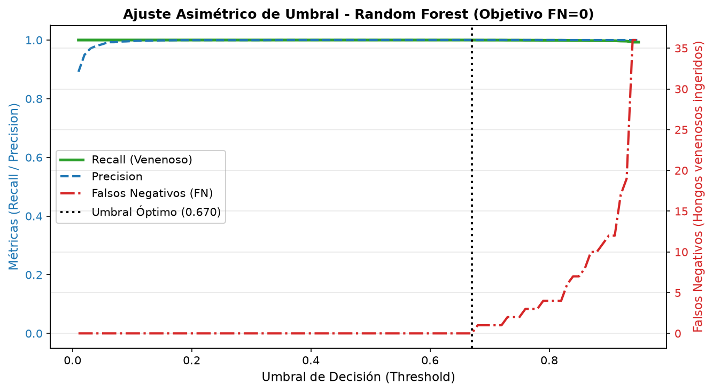
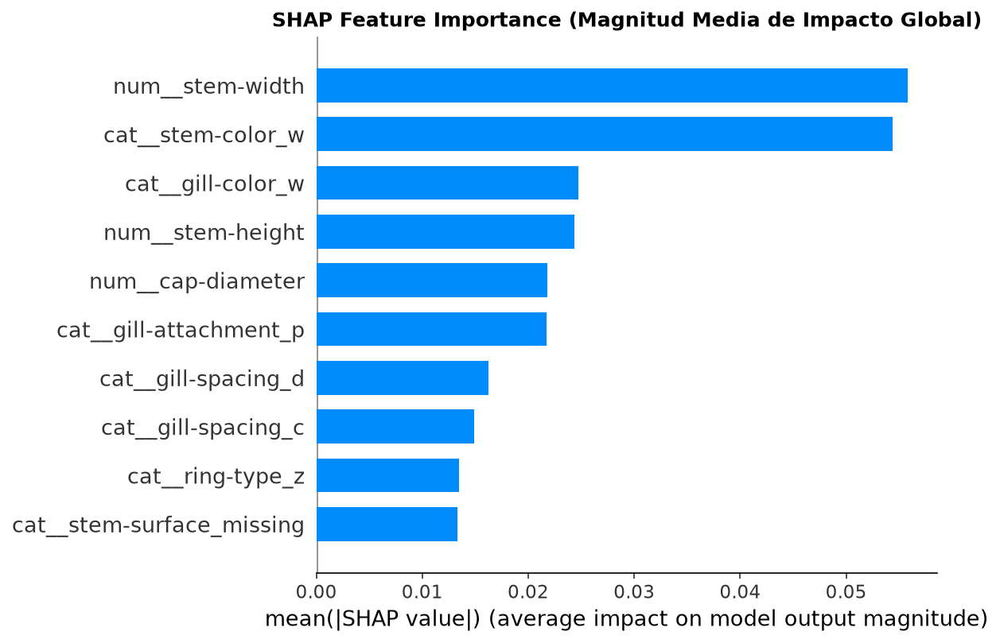

# Fórmulas Matemáticas de los Modelos de Machine Learning
## Proyecto: Sistema Inteligente de Clasificación Micológica
**Dataset:** Secondary Mushroom Dataset (61,069 registros)  
**Variable Objetivo:** $Y \in \{0, 1\}$ (0 = Comestible / *Edible*, 1 = Venenoso / *Poisonous*)

---

## 1. Regresión Logística (`LogisticRegression`)

La Regresión Logística modela la probabilidad a posteriori de que un hongo sea venenoso ($Y=1$) condicionado a su vector de características preprocesadas $\mathbf{x} \in \mathbb{R}^d$.

### 1.1 Función de Hipótesis (Sigmoide / Logística)
$$P(Y=1 \mid \mathbf{x}) = \sigma(z) = \frac{1}{1 + e^{-z}}$$

donde el predictor lineal $z$ se define como:
$$z = w_0 + \sum_{j=1}^d w_j x_j = \mathbf{w}^T \mathbf{x}$$

- $\mathbf{w} = [w_1, w_2, \dots, w_d]^T$ son los coeficientes o pesos del modelo.
- $w_0$ es el sesgo (*bias* o intercepto).

### 1.2 Función de Pérdida (Binary Cross-Entropy / Log-Loss con Regularización $L_2$)
Scikit-Learn optimiza la log-verosimilitud negativa con penalización Ridge ($L_2$):

$$J(\mathbf{w}) = -\frac{1}{N} \sum_{i=1}^N \left[ y_i \ln(\sigma(\mathbf{w}^T \mathbf{x}_i)) + (1 - y_i) \ln(1 - \sigma(\mathbf{w}^T \mathbf{x}_i)) \right] + \frac{1}{2C} \|\mathbf{w}\|_2^2$$

- $N$: Número de instancias en el conjunto de entrenamiento.
- $C$: Inverso de la fuerza de regularización ($C = \frac{1}{\lambda}$).

### 1.3 Regla de Decisión y Umbral Asimétrico ($\tau$)
$$\hat{y} = \begin{cases} 1 & \text{si } P(Y=1 \mid \mathbf{x}) \ge \tau \\ 0 & \text{si } P(Y=1 \mid \mathbf{x}) < \tau \end{cases}$$

Bajo el enfoque estándar $\tau = 0.50$. En nuestra **metodología de riesgo cero**, $\tau^*$ se calibra sobre el modelo que se despliega en producción: la Regresión Logística ilustra el efecto con $\tau^* < 0.50$; el modelo ganador (Random Forest) opera con $\tau^* = 0.67$ en la rejilla extendida $\tau \in [0.01, 0.95]$ — ver §5.3.

---

## 2. Random Forest (`RandomForestClassifier`)

Random Forest es un ensamble de aprendizaje no paramétrico basado en **Bagging** (*Bootstrap Aggregating*) y subespacios aleatorios de características.

### 2.1 Criterio de Impureza de Gini (División de Nodos)
Para un nodo $t$ con proporción de clases $p_k(t) = \frac{N_{t, k}}{N_t}$ donde $k \in \{0, 1\}$:

$$I_G(t) = 1 - \sum_{k=0}^1 p_k(t)^2 = 1 - \left( p_0(t)^2 + p_1(t)^2 \right)$$

### 2.2 Ganancia de Información / Reducción de Impureza
Al dividir un nodo padre $t$ en un hijo izquierdo $t_L$ e hijo derecho $t_R$ mediante un corte de variable $\theta = (j, v)$:

$$\Delta I_G(t, \theta) = I_G(t) - \left( \frac{N_L}{N_t} I_G(t_L) + \frac{N_R}{N_t} I_G(t_R) \right)$$

El árbol selecciona el corte que maximiza $\Delta I_G(t, \theta)$ evaluando sobre un subconjunto aleatorio de $\sqrt{d}$ variables.

### 2.3 Agregación del Ensamble
Dado un bosque de $B$ árboles $\{T_1, T_2, \dots, T_B\}$:

- **Probabilidad agregada:**
  $$\hat{P}(Y=1 \mid \mathbf{x}) = \frac{1}{B} \sum_{b=1}^B P_b(Y=1 \mid \mathbf{x})$$

- **Predicción final por votación de mayoría:**
  $$\hat{y} = \text{moda} \left\{ T_1(\mathbf{x}), T_2(\mathbf{x}), \dots, T_B(\mathbf{x}) \right\}$$

---

## 3. XGBoost (`XGBClassifier`)

XGBoost (*Extreme Gradient Boosting*) es un algoritmo de ensamble secuencial que optimiza una función objetivo específica mediante árboles de regresión aditivos (CART).

### 3.1 Modelo Aditivo
La predicción acumulada en la iteración $t$ para una instancia $i$ es:
$$\hat{y}_i^{(t)} = \sum_{k=1}^t f_k(\mathbf{x}_i) = \hat{y}_i^{(t-1)} + f_t(\mathbf{x}_i)$$
donde $f_t(\mathbf{x}) \in \mathcal{F}$ representa la estructura y pesos de las hojas del árbol en el paso $t$.

### 3.2 Función Objetivo Regularizada
$$\mathcal{L}^{(t)} = \sum_{i=1}^N l\left(y_i, \hat{y}_i^{(t-1)} + f_t(\mathbf{x}_i)\right) + \Omega(f_t)$$

El término de complejidad del árbol $\Omega(f_t)$ es:
$$\Omega(f_t) = \gamma T + \frac{1}{2} \lambda \sum_{j=1}^T w_j^2$$
- $T$: Número de hojas del árbol.
- $w_j$: Puntuación de peso (*leaf weight*) en la hoja $j$.
- $\gamma, \lambda$: Hiperparámetros de penalización de complejidad y regularización $L_2$.

### 3.3 Aproximación por Serie de Taylor (2° Orden)
$$\tilde{\mathcal{L}}^{(t)} \approx \sum_{i=1}^N \left[ l\left(y_i, \hat{y}_i^{(t-1)}\right) + g_i f_t(\mathbf{x}_i) + \frac{1}{2} h_i f_t^2(\mathbf{x}_i) \right] + \Omega(f_t)$$

Donde los gradientes de primer y segundo orden de la pérdida logística son:
$$g_i = \frac{\partial l(y_i, \hat{y}^{(t-1)})}{\partial \hat{y}^{(t-1)}} = \sigma(\hat{y}_i^{(t-1)}) - y_i$$
$$h_i = \frac{\partial^2 l(y_i, \hat{y}^{(t-1)})}{\partial (\hat{y}^{(t-1)})^2} = \sigma(\hat{y}_i^{(t-1)}) \left( 1 - \sigma(\hat{y}_i^{(t-1)}) \right)$$

### 3.4 Peso Óptimo de la Hoja y Ganancia de Corte (Split Gain)
- **Peso analítico óptimo en la hoja $j$:**
  $$w_j^* = -\frac{\sum_{i \in I_j} g_i}{\sum_{i \in I_j} h_i + \lambda}$$

- **Ganancia de división para evaluar cortes:**
  $$\text{Gain} = \frac{1}{2} \left[ \frac{\left( \sum_{i \in I_L} g_i \right)^2}{\sum_{i \in I_L} h_i + \lambda} + \frac{\left( \sum_{i \in I_R} g_i \right)^2}{\sum_{i \in I_R} h_i + \lambda} - \frac{\left( \sum_{i \in I} g_i \right)^2}{\sum_{i \in I} h_i + \lambda} \right] - \gamma$$

---

## 4. Red Neuronal Perceptrón Multicapa (`MLPClassifier`)

Red Neuronal Artificial densa con arquitectura feedforward y entrenamiento por retropropagación del gradiente (*Backpropagation*).

### 4.1 Propagación Hacia Adelante (Forward Propagation)
Para cada capa oculta $l \in \{1, 2\}$ con matriz de pesos $\mathbf{W}^{[l]}$ y vector de sesgos $\mathbf{b}^{[l]}$:

$$\mathbf{z}^{[l]} = \mathbf{W}^{[l]} \mathbf{a}^{[l-1]} + \mathbf{b}^{[l]}$$
$$\mathbf{a}^{[l]} = g(\mathbf{z}^{[l]})$$

- **Capa 0 (Entrada):** $\mathbf{a}^{[0]} = \mathbf{x} \in \mathbb{R}^{128}$ (características preprocesadas).
- **Función de Activación Oculta (ReLU):**
  $$\text{ReLU}(z) = \max(0, z)$$
- **Capa de Salida (Neurona Única):**
  $$\hat{y} = a^{[L]} = \sigma(z^{[L]}) = \frac{1}{1 + e^{-z^{[L]}}}$$

### 4.2 Función de Pérdida con Penalización $L_2$ ($\alpha$)
$$\mathcal{L}(\mathbf{W}, \mathbf{b}) = -\frac{1}{N} \sum_{i=1}^N \left[ y_i \ln(a_i^{[L]}) + (1 - y_i) \ln(1 - a_i^{[L]}) \right] + \frac{\alpha}{2N} \sum_{l=1}^L \|\mathbf{W}^{[l]}\|_F^2$$

donde $\|\mathbf{W}\|_F$ es la norma de Frobenius.

### 4.3 Actualización de Parámetros con Optimizador Adam
Adam (*Adaptive Moment Estimation*) computa tasas de aprendizaje adaptativas basadas en momentos de primer y segundo orden:

$$m_t = \beta_1 m_{t-1} + (1 - \beta_1) \nabla_\theta \mathcal{L}_t$$
$$v_t = \beta_2 v_{t-1} + (1 - \beta_2) (\nabla_\theta \mathcal{L}_t)^2$$

Corrección de sesgo:
$$\hat{m}_t = \frac{m_t}{1 - \beta_1^t}, \quad \hat{v}_t = \frac{v_t}{1 - \beta_2^t}$$

Regla de actualización:
$$\theta_{t+1} = \theta_t - \frac{\eta}{\sqrt{\hat{v}_t} + \epsilon} \hat{m}_t$$

---

## 5. Métricas de Evaluación y Calibración de Costos

### 5.1 Métricas de Evaluación Toxicológica
Dada la matriz de confusión con Verdaderos Positivos ($TP$), Falsos Negativos ($FN$), Falsos Positivos ($FP$) y Verdaderos Negativos ($TN$):

- **Accuracy (Exactitud General):**
  $$\text{Accuracy} = \frac{TP + TN}{TP + TN + FP + FN}$$

- **Recall / Sensibilidad (Cobertura de hongos venenosos - Objetivo $\to 1.0$):**
  $$\text{Recall} = \frac{TP}{TP + FN}$$

- **Precision (Precisión en hongos clasificados como venenosos):**
  $$\text{Precision} = \frac{TP}{TP + FP}$$

- **F1-Score (Media Armónica balanceada):**
  $$\text{F1} = 2 \cdot \frac{\text{Precision} \cdot \text{Recall}}{\text{Precision} + \text{Recall}} = \frac{2 TP}{2 TP + FP + FN}$$

### 5.2 Formulación Matemática del Umbral de Riesgo Cero ($\tau^*$)
$$\tau^* = \max \left\{ \tau \in (0, 0.95] \;\middle|\; FN(\tau) = 0 \right\}$$

Donde:
$$FN(\tau) = \sum_{i=1}^N \mathbb{I}\left( y_i = 1 \;\land\; P(Y=1 \mid \mathbf{x}_i) < \tau \right)$$

El barrido se realiza sobre la rejilla $\tau \in [0.01, 0.95]$ con paso $0.01$ usando las probabilidades del **modelo ganador** en validación. Extender la búsqueda por encima del umbral por defecto ($0.50$) permite maximizar la precisión sin romper la garantía de $FN = 0$: a mayor $\tau$, menos falsos positivos, mientras el recall de la clase venenosa permanezca en 100 %.

**Resultado de la calibración (Random Forest, modelo ganador):** $\tau^* = 0.67$, con $FN(\tau^*) = 0$ y recall de la clase venenosa del 100 % en validación.

### 5.3 Evidencia Empírica en el Conjunto de Prueba (Test)

Los gráficos siguientes son generados por `notebooks/03_model_training.ipynb` sobre el conjunto de prueba (datos nunca vistos durante el entrenamiento) y el script `generar_figuras_modelo.py`.

**Comparativa de los 4 modelos en test** — 3 de 4 superan la precisión del 95 % exigida; el ganador (Random Forest) se seleccionó con el criterio jerárquico $FN=0 \to F1 \to \text{ROC-AUC} \to$ tiempo de entrenamiento:

| Modelo | Accuracy | Precision | Recall (venenoso) | F1 | ROC-AUC | FN |
|---|---|---|---|---|---|---|
| Logistic Regression | 0.8670 | 0.8817 | 0.8782 | 0.8800 | 0.9363 | 619 |
| **Random Forest (ganador)** | **1.0000** | **1.0000** | **1.0000** | **1.0000** | **1.0000** | **0** |
| XGBoost | 0.9940 | 0.9978 | 0.9913 | 0.9946 | 0.9999 | 44 |
| MLP Neural Network | 1.0000 | 1.0000 | 1.0000 | 1.0000 | 1.0000 | 0 |

**Calibración del umbral de riesgo cero** sobre el modelo ganador:

**Explicabilidad global (SHAP)** — las variables morfológicas que más aportan a la clase venenosa:

