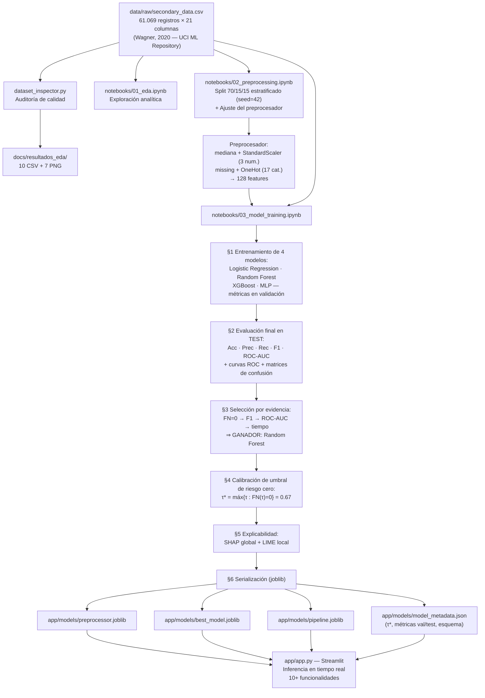

# Trazabilidad del Proyecto — Simulación de Resultados

## Sistema Inteligente de Clasificación Micológica — Hito 2

> **Criterio de rúbrica atendido:** *Simulación de Resultados — explicación clara de la trazabilidad (50 pts, nivel máximo).*

Este documento permite seguir **cualquier resultado del sistema de extremo a extremo**: desde el registro crudo del dataset hasta el dictamen que muestra la aplicación, pasando por cada notebook, artefacto intermedio y métrica.

---

## 1. Diagrama del pipeline de datos y modelos



## 2. Matriz de trazabilidad

| # | Etapa | Insumo de entrada | Proceso (notebook / módulo) | Artefacto de salida | Evidencia / métrica |
|---|---|---|---|---|---|
| 1 | **Ingesta y auditoría** | `data/raw/secondary_data.csv` | `dataset_inspector.py` | `docs/resultados_eda/` (tipos, nulos, duplicados, balance, outliers, categorías) | 61.069 registros; balance 55,5 % p / 44,5 % e; 146 duplicados (0,24 %) |
| 2 | **Exploración (EDA)** | Dataset crudo | `notebooks/01_eda.ipynb` (celdas 2–4) | Distribución de clase y estadísticas | `docs/resultados_eda/10_balance_clases.png`, `06_estadisticas_numericas.csv` |
| 3 | **Partición estratificada** | Dataset crudo | `notebooks/02_preprocessing.ipynb` (celda 7) + `src/data_loader.py:get_train_val_test_data` | Train 70 % / Val 15 % / Test 15 % (`random_state=42`) | Proporción de clase preservada en los 3 subconjuntos |
| 4 | **Preprocesamiento** | Particiones del paso 3 | `notebooks/02_preprocessing.ipynb` (celda 9) + `src/models.py:build_preprocessing_pipeline` | Transformador ajustado (imputación + escalado + One-Hot) | 128 features codificadas; ajuste **solo con train** (sin fuga de datos) |
| 5 | **Entrenamiento de 4 modelos** | Train + preprocesador | `notebooks/03_model_training.ipynb` §1 + `src/models.py:get_candidate_models` | 4 pipelines ajustados en memoria | Validación: LR 86,8 % · RF 100 % · XGB 99,4 % · MLP 100 % |
| 6 | **Evaluación final en TEST** | Test (datos nunca vistos) | `notebooks/03_model_training.ipynb` §2 | `df_test_comparison` + 3 figuras | Test: LR 86,7 % · **RF 100 %** · XGB 99,4 % (prec. 99,8 %) · MLP 100 %; 3 de 4 modelos con precisión > 95 % |
| 7 | **Selección del modelo ganador** | Métricas de test | `notebooks/03_model_training.ipynb` §3 (criterio jerárquico) | `best_model_name` = **Random Forest** | Empate técnico RF/MLP (todo 1,0) → desempate por tiempo de entrenamiento (1,25 s vs 3,73 s) |
| 8 | **Calibración de umbral (riesgo cero)** | Probabilidades del ganador en validación | `notebooks/03_model_training.ipynb` §4 + `src/utils.py:evaluate_thresholds`, `find_zero_fn_threshold` | $\tau^* = 0{,}67$ | $FN(\tau^*) = 0$ con recall 100 % en la clase venenosa |
| 9 | **Explicabilidad global (SHAP)** | Test transformado (muestra de 300) | `notebooks/03_model_training.ipynb` §5.1 (TreeExplainer) | Ranking de importancia morfológica | `docs/figuras_modelo_matematico/shap_importancia_test.png` |
| 10 | **Explicabilidad local (LIME)** | Instancia #0 de test | `notebooks/03_model_training.ipynb` §5.2 (LimeTabularExplainer) | Pesos locales por característica | Salida impresa en el notebook con impacto por rasgo |
| 11 | **Serialización** | Objetos en memoria | `notebooks/03_model_training.ipynb` §6 (`joblib.dump`) | `app/models/preprocessor.joblib` · `best_model.joblib` · `pipeline.joblib` · `model_metadata.json` | Metadatos: τ*, criterio, métricas val/test, matriz de confusión, categorías y rangos |
| 12 | **Verificación de inferencia** | Artefactos serializados | `notebooks/03_model_training.ipynb` §6.1 | Dictamen de una muestra real de test | Probabilidad + umbral aplicado + etiqueta real coincidente |
| 13 | **Despliegue local (demo)** | Artefactos + `app/models/model_metadata.json` | `app/app.py` (Streamlit) | Aplicación interactiva | Predicción individual y por lotes, explicabilidad y dashboard de métricas |

## 3. Cadena de custodia del dato (resumen de una predicción)

```text
Registro crudo (20 características + clase)
  → load_raw_data() ........................ separador ';', tipado pandas
  → get_train_val_test_data() ............... split estratificado seed=42 (aislado en test)
  → preprocessor.joblib (ColumnTransformer) . imputación → escalado → One-Hot (128 features)
  → best_model.joblib (RandomForest) ........ P(venenoso) = predict_proba[:, 1]
  → regla de decisión τ* = 0.67 ............. venenoso ⟺ P ≥ 0.67  (garantía FN = 0)
  → model_metadata.json ..................... esquema, umbral y métricas de soporte
  → app/app.py .............................. dictamen interactivo al usuario
```

## 4. Reproducibilidad total

**Semilla única `random_state=42`** en: partición de datos (`train_test_split`), Logistic Regression, Random Forest, XGBoost, MLP y el muestreo de LIME. Cualquier persona puede regenerar todos los artefactos y métricas:

```bash
# 1. Entorno
python -m venv .venv && .venv\Scripts\activate
pip install -r requirements.txt

# 2. Auditoría de datos (opcional, regenera docs/resultados_eda/)
python dataset_inspector.py

# 3. Notebooks en orden (01 → 02 → 03)
jupyter nbconvert --to notebook --execute --inplace notebooks/01_eda.ipynb
jupyter nbconvert --to notebook --execute --inplace notebooks/02_preprocessing.ipynb
jupyter nbconvert --to notebook --execute --inplace notebooks/03_model_training.ipynb

# 4. Demo local
streamlit run app/app.py
```

## 5. Mapa de criterios del Hito 2 → evidencia

| Criterio (rúbrica) | Evidencia en el repositorio |
|---|---|
| **Construcción del Dataset** (balanceado, > 35.000 registros — 40 pts) | `docs/construccion_dataset.md`; `docs/resultados_eda/05_balance_clases.csv` (61.069 registros; 55,5 % / 44,5 %) |
| **Selección de 4 modelos ML** con soporte teórico (50 pts) | `src/models.py:get_candidate_models`; `notebooks/03_model_training.ipynb` §1; marco teórico en `docs/formulas_matematicas_modelos.md` |
| **Simulación de Resultados — trazabilidad** (50 pts) | Este documento + notebooks ejecutados de punta a punta + metadatos versionados |
| **Modelo matemático** con ecuaciones y gráficos (100 pts) | `docs/formulas_matematicas_modelos.md` + `docs/figuras_modelo_matematico/` |
| **Implementación de aplicación** precisión > 95 % y 10 funcionalidades (50 pts) | `app/app.py`; precisión del modelo desplegado en test: **100 %** (`model_metadata.json → best_model_test_metrics`) |
